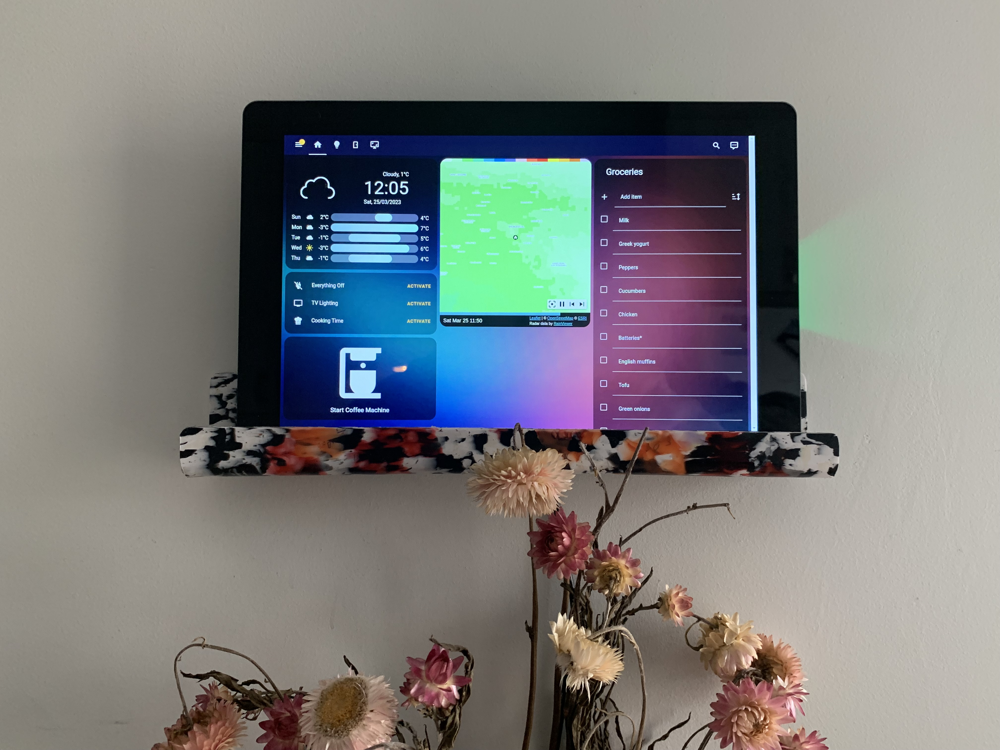
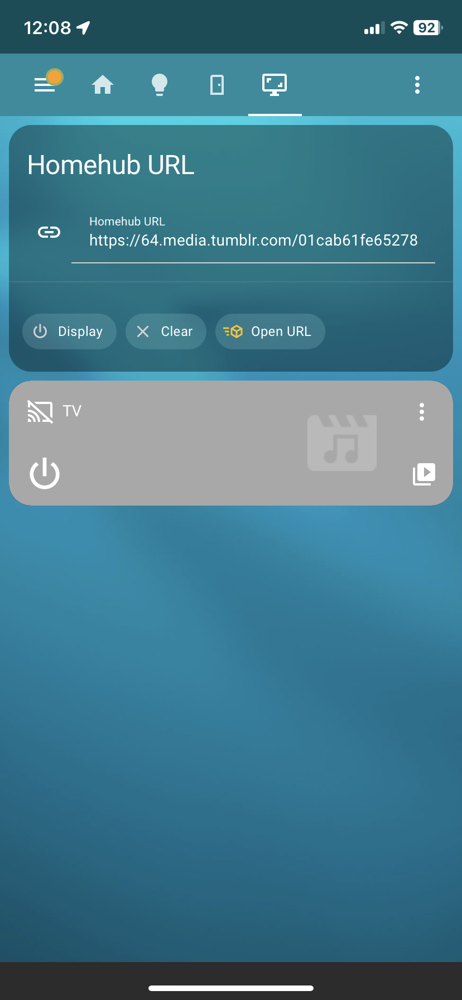
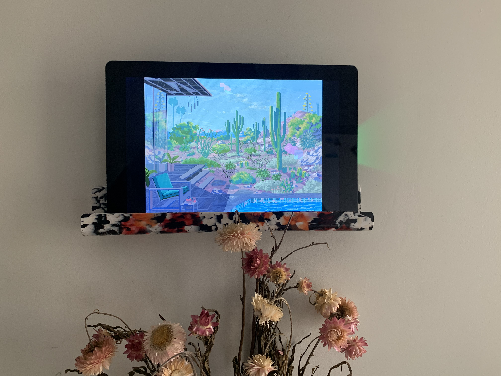

# home-hub
Local area network REST API which allows a display to be set via sending a URL. Used to control a digital display at home.

# Purpose
This project was created with the purpose of displaying digital art on a wall. Specifically, I thought it would be really cool to have pixel art gifs shown as art on the wall. GIFs like this:

> Credit goes to [Artist 1041uuu](https://1041uuu.tumblr.com/) from Tumblr. Check out their stuff!

As the project evolved, though, I realized the potential use cases for this project were much greater. I now use this API to control my local Home Assistant, display digital art, and put up recipes as I cook. It has evolved into one of my mose useful projects, and it is extremely simple.

# The HomeHub Display Demo
The HomeHub is on the wall in my kitchen. This API opens the home assistant local URL by default, which looks like this:

To interface with the HomeHub and upload URLs to the display, I created a HomeAssistant widget which looks like this:

The display button either puts the screen to sleep or wakes it. `Open URL` opens the url entered into the text box in full screen, while the `Clear` button closes the page which was opened.

From here, recipes, art, youtube videos, whatever you want is uploaded. A sample art put on display looks like this:

# Installation
## Hardware
The hardware used for this project involves:
* Raspberry Pi 4, 2GB of RAM
* Sunfounder 10" Touch Display for Raspberry pi
    * [Link here](https://www.sunfounder.com/products/10inch-touchscreen-for-raspberrypi)

## Software
The software was written to run on Raspbian OS, the default Raspberry Pi OS. However, it could be easily adapted to run on other OS's. The things which make it specific to Raspbian are the following:
* A `.desktop` file was included in this repo for a Raspbian desktop shortcut to allow one to run the server with ease. This would have to be adapted for another OS
* The homehub controller (`src/utils/HubController`) uses the Selenium web driver and **chromium browser** by default, which comes installed on Raspbian
    * Other OS's may not have chromium and may need extra installation

Once this repo is cloned on the Pi (assuming a raspberry pi 4 with Raspbian installed), the following steps need to be taken:
1. Install the chromium driver with `sudo apt -y install chromium-chromedriver`. This allows the HubController to open chrome windows
2. Install the python dependencies with `pip install -r requirements.txt`
3. Take note of the folder where you have cloned the repo to
4. Copy the `homehub.desktop` to the `/Desktop` folder
5. Modify the path in `homehub.desktop` line 3 to reflect the path noted in step 2. This allows the desktop shortcut to find the script which starts the server
6. Double click the shortcut and watch the HomeHub come to life!

## Notes
* The server opens a browser to the homeassistant local web UI by default. This can be removed if you do not have home assistant
    * In order to authenticate the home hub, I had to add a trusted network authentication scheme in home assistant to allow the IP of the home hub (and avoid re-logging in every time)
    * More on [Authentication Providers](https://www.home-assistant.io/docs/authentication/providers/)
